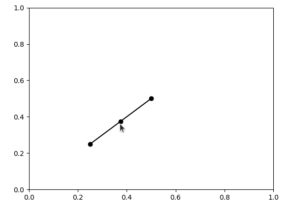

# mpl-draggable-line

[](https://github.com/ianhi/mpl-draggable-line/raw/main/LICENSE)
[](https://pypi.org/project/mpl-draggable-line)
[](https://python.org)
[](https://github.com/ianhi/mpl-draggable-line/actions)
[](https://codecov.io/gh/ianhi/mpl-draggable-line)

Draggable Line Widget for matplotlib

```bash
pip install mpl-draggable-line
```



